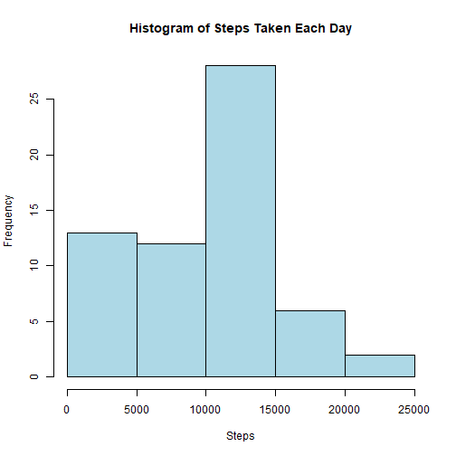
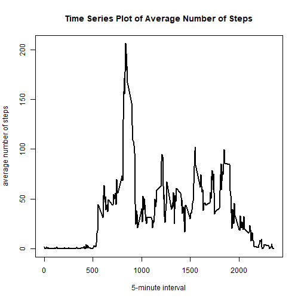
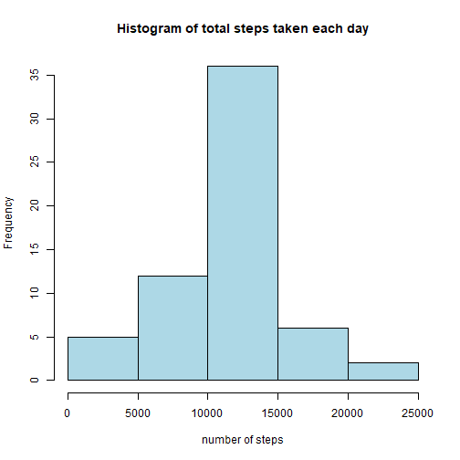

#Reproducible Research Course Project 1 
9/25/2018 

##Loading and Preprocessing the data 
Show any code that is needed to

###1. Load the data 


```r
dat <- read.csv("activity.csv") 
```

###2. Process/transform the data (if necessary) into a format suitable for your analysis. 
Convert the date variable into date data. 


```r
dates <- as.Date(dat$date)
```

##What is mean total number of steps taken per day?
For this part of the assignment, you can ignore the missing values in the dataset. 

###1. Calculate the total number of steps taken each day.
Load the 'dplyr' package. 

```r
library(dplyr)
```

Calculate the total number of steps taken per day and save to new variable called totDay

```r
totDay <- dat %>% group_by(date) %>% summarize(steps=sum(steps, na.rm=T))
```

###2. Make a histogram of the total number of steps taken each day. 

```r
plot1 <- hist(totDay$steps, xlab="Steps", main="Histogram of Steps Taken Each Day", col="lightblue")
```



###3. Calculate and report the mean and median of the total number of steps taken each day. 

```r
meanDay <- mean(totDay$steps) 
medianDay <- median(totDay$steps) 
```
For the total number of steps taken each day, the mean is 9354.2295082 and the median is 10395. 

##What is the average daily activity pattern?
###1. Make a time series plot (i.e. type="l") of the 5-minute interval (x-axis) and the average number of steps taken, averaged across all days (y-axis). 

Make a new data frame with the average number of steps taken at each 5-minute interval across all days. 

```r
totInt <- dat %>% group_by(interval) %>% summarize(steps=mean(steps, na.rm=T))
```

Plot the time series. 

```r
plot2 <- with(totInt, plot(interval, steps, type="l", lwd=2, xlab="5-minute interval", ylab="average number of steps", main="Time Series Plot of Average Number of Steps"))
```



###2. Which 5-minute interval, on average across all the days in the dataset, contains the maximum number of steps. 

```r
maxInt <- totInt$interval[which.max(totInt$steps)]
```
The 835 interval contains the maximum number of steps. 

##Imputing missing values
###1. Calculate and report the total number of missing values in the dataset (i.e. the total number of rows with NAs) 

```r
missing <- nrow(dat) - sum(complete.cases(dat))
```

There are 2304 number of rows with NAs. 

###2. Devise a strategy for filling in all of the missing values in the dataset. The strategy does not need to be sophisticated. For example, you could use the mean/median for that day, or the mean for that 5-minute interval, etc. 
We will replace the missing values with the mean for that 5-minute interval.

###3. Create a new dataset that is equal to the original dataset but with the missing data filled in. 
Create new dataset called filledDat.

```r
filledDat <- dat
for (i in 1:nrow(filledDat)){
	if(is.na(filledDat$steps[i])){
		interval <- filledDat$interval[i]
		filledDat$steps[i] <- totInt$steps[which(totInt$interval==interval)]
	}
}
```

###4. Make a histogram of the total number of steps taken each day.

```r
plot3 <- hist(tapply(filledDat$steps, filledDat$date, sum), col="lightblue", xlab="number of steps", main="Histogram of total steps taken each day")
```



###Calculate and report the **mean** and **median** total number of steps taken per day. 

```r
meanDay <- with(filledDat, mean(tapply(steps,date,sum)))
medianDay <- with(filledDat, median(tapply(steps,date,sum)))
```
For the total number of steps taken per day, the mean is 1.0766189 &times; 10<sup>4</sup> and the median is 1.0766189 &times; 10<sup>4</sup>. 

###Do these values differ from the estimates from the first part of the assignment? What is the impact of imputing missing data on the estimates of the total daily number of steps?
Yes, these values differ from the estimate from the first part of the assignment, the mean and median both increased after imputting missing data. 

##Are there differences in activity patterns between weekdays and weekends?
For this part the weekdays() function may be of some help here. Use the dataset with the filled-in missing values for this part. 

###1. Create a new factor variable in the dataset with two levels - "weekday" and "weekend" indicating whether a given date is a weekday or weekend day. 

```r
filledDat$date <- as.Date(filledDat$date) 
dayname <- weekdays(filledDat$date)
weekday <- ifelse(dayname=="Sunday"|dayname=="Saturday", "weekend", "weekday")
weekday.f <- factor(weekday, labels=c("weekday", "weekend")) 
filledDat <- cbind(filledDat, weekday.f)
```

###2. Make a panel plot containing a time series plot (i.e. type="l") of the 5-minute interval (x-axis) and the average number of steps taken, averaged across all weekday days or weekend days (y-axis).


```r
totInt <- filledDat %>% group_by(interval, weekday.f) %>% summarize(steps=mean(steps))

library(lattice)
plot4 <- xyplot(steps~interval|weekday.f, data=totInt, layout=c(1,2), type="l")
print(plot4)
```


